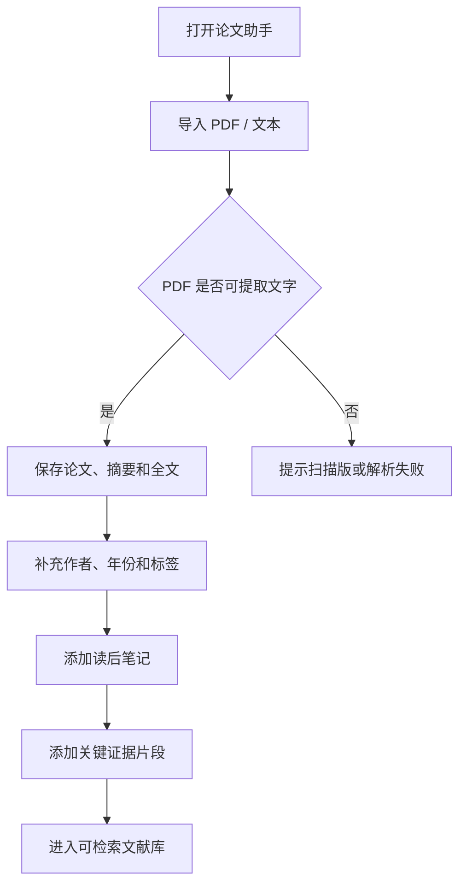
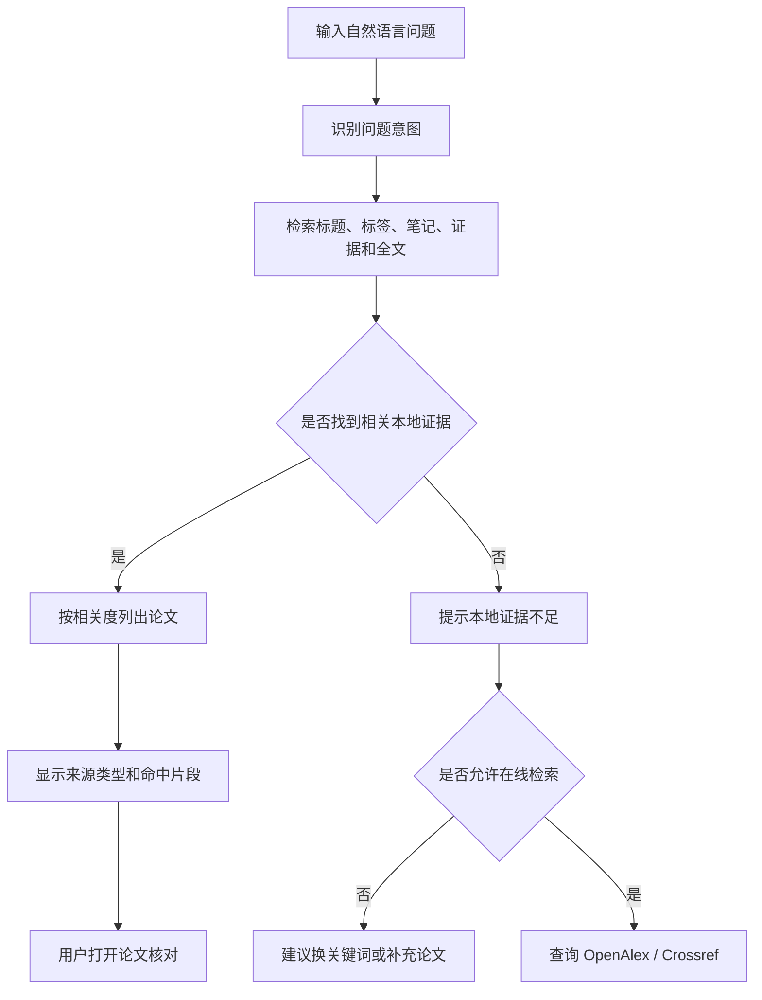
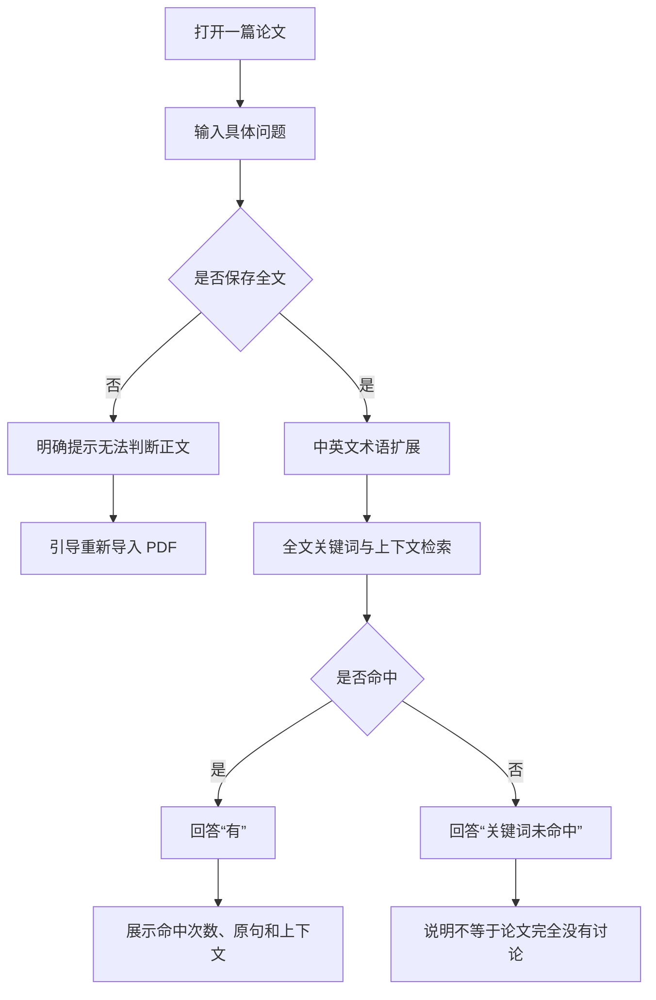
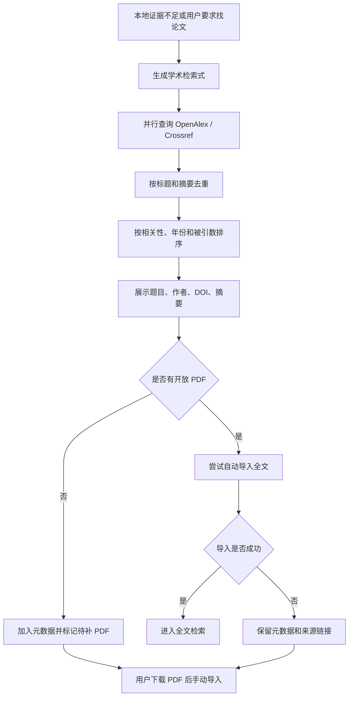

# 用户流程

## 1. 首次使用：建立论文记忆

## 2. 基于个人文献库提问

## 3. 单篇论文全文查证

## 4. 在线发现新论文

## 5. 核心页面结构

### 对话页

- 问题输入
- 本地 / 智能联网模式
- 本地证据引用卡片
- 在线候选论文
- 待补 PDF 状态

### 文献库

- 标题、作者、年份和标签
- 全文 / 摘要 / 元数据状态
- 搜索与筛选
- 单篇论文详情
- 全文定向查证
- 读后笔记和证据片段

### 导入页

- PDF / 文本 / Markdown
- 手动录入
- JSON 批量导入和导出
- 错误恢复提示
